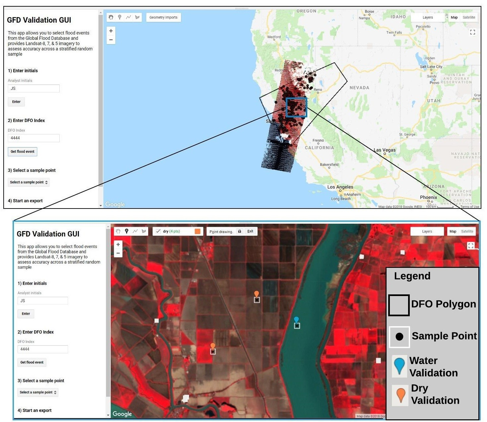

## Global Flood Database Scripts & Data

This repository includes code and supporting data for the Global Flood Database. Below are descriptions of the data and code and how they relate to *Tellman et al, Satellite imaging reveals increased proportion of population exposed to floods; Nature; https://doi.org/10.1038/s41586-021-03695-w*

### Data
#### Flood Maps

The flood maps (.tif files) can be accessed through a visualization and data portal at: http://global-flood-database.cloudtostreet.info/

You can also download the entire database as GeoTIFF files directly from Google Cloud Storage (GCS) using the [gsutil](https://cloud.google.com/storage/docs/gsutil_install) [cp command](https://cloud.google.com/storage/docs/gsutil/commands/cp) from the GCS bucket "gfd_v1_4". You can use the following command to download the entire database to a local directory:

`gsutil -m cp gs://gfd_v1_4 your/local/directory/to/save/to`

#### Flood Mapping
1. `data\shp_files\dfo_polys_20191203.shp`: the Dartmouth Flood Observatory (DFO) flood polygon dataset used in our analyses and processing of satellite imagery.
2. `data\gfd_qcdatabase_2019_08_01.csv`: the Quality Control (QC) database described in Tellman et al.

#### Validation
3. `data\gfd_validation_points_2018_12_17.csv`: validation data of 123 selected flood events that includes geo-location of each assessment point, the classified data for different methods (e.g. 3day Standard), analyst initials and spectral data from the interpretation imagery (i.e. Landsat-5, 7 & 8). Field values are explained in the `main_validation.ipynb` (see below)
4. `data\gfd_validation_sensitivity.csv`: assessed validation points up to 400 points for selected flood events to test appropiate sampling intensity
5. `data\gfd_validation_metrics.csv`: summarized validation metrics (e.g. commission error) for each validation flood
6. `data\sample_frame_CC20_D1_051618.csv`: a summary of available Landsat images (5, 7 & 8) for each flood event. Used to determine which flood events can be used to collect validation data. The field `DELTA` is the number of days following max flood extent, `CLOUD_COVER` is the maximum allowable percent cloud cover for a validation image, `X` and `Y` are the centroid of the flood event from the DFO polygon.

#### Exposed Population Estimates
7. `data\SSP2010.csv`: 2010 population estimates from the SSP2 (Socioeconomic pathways scenario)
8. `data\SSP2030.csv`: 2030 population estimates from the SSP2 (Socioeconomic pathways scenario)
9. `data\aqueductcountrydata.csv`: WRI Aqueduct flood exposure estimates for various return periods for 2010 and 2030
10. `data\aqueduct_dictionary.xlsx`: data dictionary to explain columns in WRI Aqueduct flood exposure estimates
11. `data\gfd_popsummary.csv`: Global Flood Database population exposure estimates per country, in 2000 and 2015, and associated statistics.
12. `data\GFDabove_13_wBias.csv`: Global Flood Database population exposure estimates per country, in 2000 and 2015, with bias correction factor based on comparison to HRSL data. Note Montenegro and Serbia are treated as one country here (Yugoslavia), and Sudan/South Sudan are treated as one country (Sudan) as these country splits occured during the 2000-2015 period of analysis.
13. `data\popchange_Aque_GFD.csv`: selected 122 countries (represented in the Global Flood Database) of the 2030 estimates for flood exposure from WRI estimates used to report the absolute population for 2030 flood exposure, with population and climate components specifically. Note Montenegro and Serbia are reported seperately (instead of as Yugoslavia), and Sudan and South Sudan are reported seperately (instead of as Sudan).
14. `data\gfd_popdictionary.xlsx`: data dictionary to explain columns in Global Flood Database exposure estimates
15. **Population Exposed Per Event**: Population exposure estimate per event. To access click on the `INFO` button on our data portal at: http://global-flood-database.cloudtostreet.info/
16. **Population Exposed Per Country Per Event**: Population exposure estimates per country by event. To access click on the `INFO` button on our data portal at: http://global-flood-database.cloudtostreet.info/

#### Pop Sensitivity & Uncertainty
15. `data\gfd_popsensitivity.csv`: Global Flood database population exposure estimates per country using the Global Human Settlement Layer (GHSL), High Resolution Settlement Layer (HRSL) and GridPop3. Countries are limited to those with HRSL data.

#### Flood Mechanism
16. `data\gfd_floodmechanism.csv`: Global Flood database disaggregated by "flood type" (data from the Dartmouth Flood Observatory) and estimated population exposure estimate per in 2000 and 2015.

### Code
Our code includes modules written in Python, Javascript and R. In the case of Javascript, this code is stored as a `.txt` file (`.js` files are prohibited as Gmail attachments) and can be run by "copy and pasting" into [Google Earth Engine's code editor](https://code.earthengine.google.com/). Python scripts are based on [Google Earth Engine's Python API](https://developers.google.com/earth-engine/guides/python_install) and require installation before running. Additional code in R require publicly available downloads of [R or RStudio](https://rstudio.com/).

Below is a short description of scripts within our repository and how they relate to *Tellman et al, Satellite observations indicate increasing proportion of population exposed to floods*

#### Flood Mapping
1. `main_gfd.py` - uses GEE Python API to create flood maps for each Dartmouth Flood Observatory flood event. This script relies on modules found in the `flood_detection` folder. The exports are stored in Google Cloud Storage which can be accessed as described above.

#### Validation
2. `gee_sampleFrameLandsat.txt` - uses GEE Code Editor to determine what floods have available Landsat imagery coincident within 1-day of the max extent of a flood event. This code produces `data\sample_frame_CC20_D1_051618.csv`.
3. `gee_validationGUI.txt`  - used GEE Code Editor to collect validation data using a custom tool designed in GEE that retrieves a flood event, coincident Landsat imagery and creates a statrified sample. An example of our validation GUI can be seen below in **Figure 1**. Analysts can then interpret sample points based on Landsat imagery and results are recorded. This code relies upon `gee_landsatTools.txt` and `gee_misc.txt` sub-modules. The outputs of assessment points by each analyst were stored in Google Cloud Storage and is compiled here `data\gfd_validation_points_2018_12_17.csv`.
4. `main_validation.pynb` - This script uses the accuracy assessment points (i.e. `data\gfd_validation_points_2018_12_17.csv`) to calculate various accuracy metrics including ommission and commission errors. The results are stored in `data\gfd_validation_metrics.csv`. This script also analyzes the validation sensitivity (Extended Data Fig 8).

#### Exposed Population Estimates
5. `main_popstats.py` - uses GEE Python API to estimate exposed populations for each flood event and country. This script relies on modules found in the `flood_stats` folder. Outputs are available on our [data portal](http://global-flood-database.cloudtostreet.info/) by clicking on the `INFO` button. These population estimates do not filter out isolated pixels as described in the methods.
6. `main_popchange.txt` - uses GEE Code Editor to calculate population change in areas of observed inundation from GFD between years 2000 and 2015 for each country. This method removed isolated pixels for a conservative estimate of change. This script yields `data\gfd_popsummary.csv`. Additional fields in `data\gfd_popsummary.csv` are described in `data\gfd_popdictionary.xlsx`.
7. `ext.datafig10.R`-  This script was used to make extended data figure 10, which compares the population exposed to at least one flood event between 2000-2018 from the Global Flood Database to floods in 2010 in the WRI Aqueduct flood exposure 100 year return period at the country scale.
8. `ext.datafig8.R` - This script was used to make extended data figure 8, which is a sensitivity analysis of the proportion of population exposed to floods under climate change and population growth across return periods. It shows boxplots for the distribution across countries, summarized by continent.
9. `main_gfdsummarystats.R`- This script was used to generate summary statistics from the Global Flood Database for the paper.

#### Pop Sensitivity & Uncertainty
10. `main_popsensitivity.txt` - uses GEE Code Editor to calculate population exposure  using the Global Human Settlement Layer (GHSL), High Resolution Settlement Layer (HRSL) and GridPop3. This method removed isolated pixels for a conservative estimate of change. This script yields per region files that are later compiled into `data\gfd_popsensitivity.csv`.
11. `main_sensitivityanalysis.R` - R script that compiles individual region files generated from `main_popsensitivity.txt` and then calculates a bias factor. This script additionally joins the bias factor to a number of datasets including `data\gfd_popsummary.csv` and `data\gfd_floodmechanism.csv`
12. `uncertaintyanalysis.R` - R script that estimates uncertainty in population trend estimates per country using the population dataset `data\GFDabove_13_wBias.csv`. It identifies countries we deem uncertainty and reproduces Figure 2 in the Supplementary discussion. This script recalcualtes the global flood exposure trend analysis removing the "uncertain" countries.

#### Flood Mechanism
12. `main_floodmechanism.txt` - uses GEE Code Editor to disaggregate the Global Flood database into flood plains representing different causes/ drivers. Population exposure is calculated using the Global Human Settlement Layer (GHSL) for 2000 and 2015. This script yields per mechanism files that are later compiled into `data\gfd_floodmechanism.csv`.

*Figure 1.* Example of the GFD Validaiton GUI
